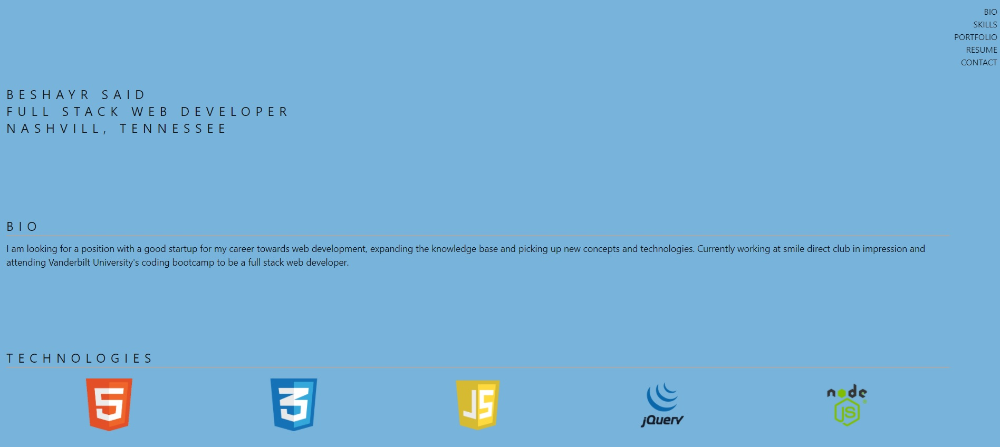

# react-portfolio

Budget-Tracker

## Install and Run the app

* Clone this repo in your terminal with the command git clone or just download it to your computer
* change directory into cd react-portfolio
* run npm install in your terminal
* run npm start and the app will run locally on port: 3000

## Project Description
A React portifolio with Responsive web design that adjusts as the user changes the screen size and the it is SPA that gives information about me and also gives links to some of my projects and social media

## Requirements

* Use React

* A `Header` component that appears on multiple pages

* A single `Project` component that will be used multiple times on a single page 

* Navigation with React Router, dynamic rendering, or another third part router

* A `Footer` component that appears on multiple pages

 ## Programs
 * HTML, CSS, Javascript, 
 * Node.js, Express.js, 
 * React JSON

## License 

## Author/s
Beshayr 

 